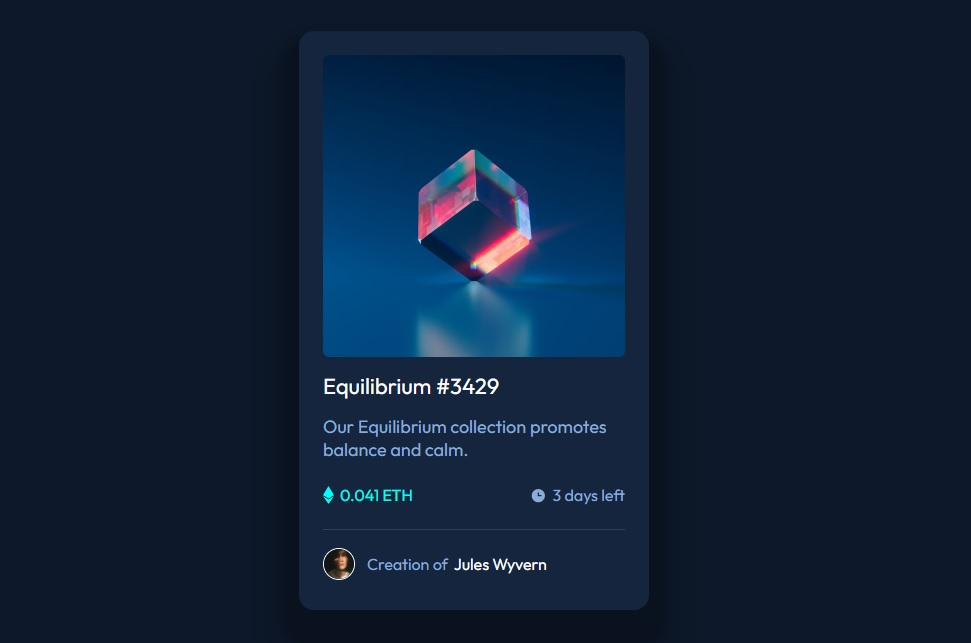

# Frontend Mentor - NFT preview card component solution

This is a solution to the [NFT preview card component challenge on Frontend Mentor](https://www.frontendmentor.io/challenges/nft-preview-card-component-SbdUL_w0U). Frontend Mentor challenges help you improve your coding skills by building realistic projects. 

## Table of contents

- [Overview](#overview)
  - [The challenge](#the-challenge)
  - [Screenshot](#screenshot)
  - [Links](#links)
- [My process](#my-process)
  - [Built with](#built-with)
  - [What I learned](#what-i-learned)
- [Author](#author)


## Overview

### The challenge

Users should be able to:

- View the optimal layout depending on their device's screen size
- See hover states for interactive elements

### Screenshot




### Links

- Solution URL: [Add solution URL here](https://www.frontendmentor.io/challenges/nft-preview-card-component-SbdUL_w0U/hub/nft-preview-card-component-V32FySzWW/solutions)
- Live Site URL: [Add live site URL here](https://mehdi-adham.github.io/NFT-preview-card-component/index.html)

## My process

### Built with

- Semantic HTML5 markup
- CSS custom properties
- Flexbox


### What I learned

how to use flex display and hsla (with opacity 0.5) and  transition: opacity 0.5s ease

```html
      <a class="nft-img" href="#">
        
        <div class="nft-img-overlay">
          
        </div>
      </a>
```
```css
.nft-img-overlay{
    border-radius: 6px;  
    background:hsla(178, 100%, 50%, 0.5);
    opacity: 0;
    width: 100%;
    height: 100%;
    position: absolute;
    left: 0;
    top: 0;
    transition: opacity 0.5s ease;
    display: flex;
    justify-content: center;
    align-items: center;
}
.nft-img-overlay:hover{
    opacity: 1;
}
```


## Author

- Website - [Mehdi Adham](https://www.your-site.com)
- Frontend Mentor - [@mehdi-adham)](https://www.frontendmentor.io/profile/mehdi-adham)


